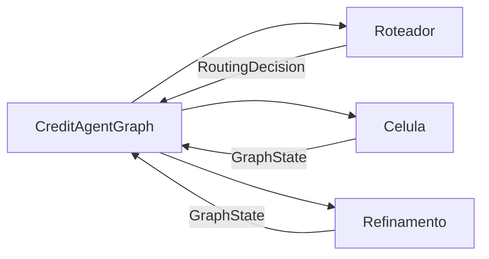
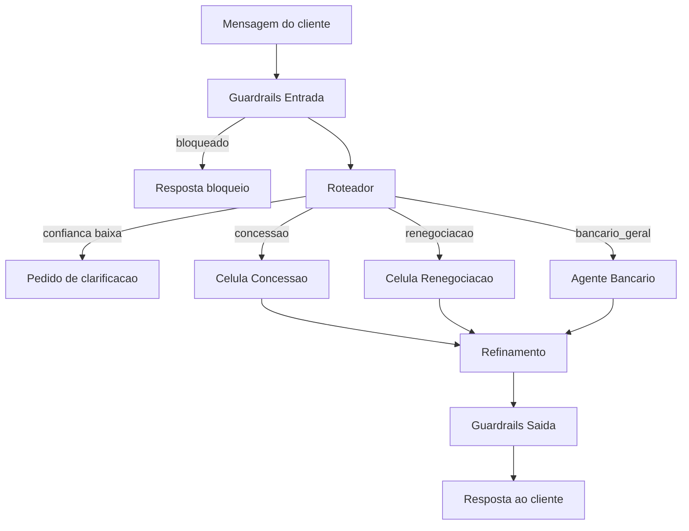
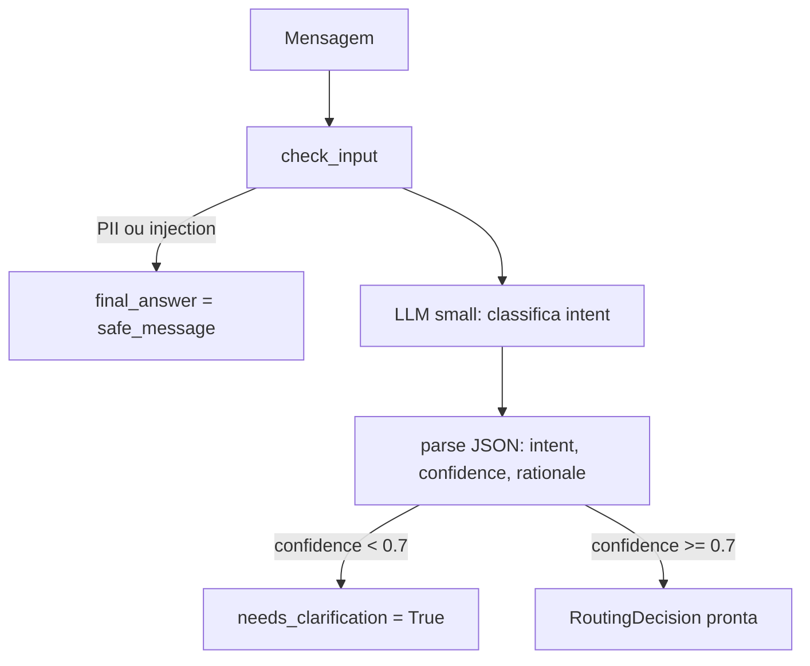
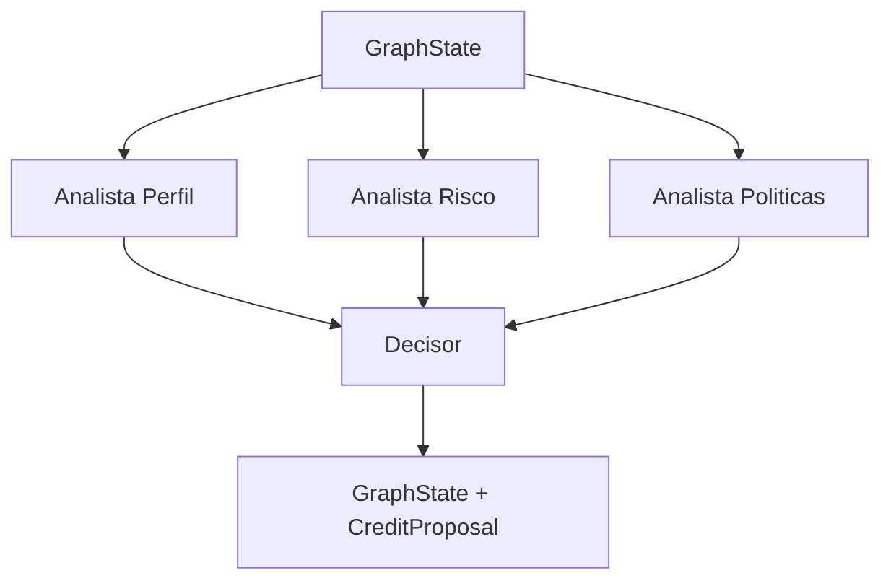

# Arquitetura - Ecossistema Multi-Agente de Credito Banco Poneiu

Referencia tecnica da arquitetura ponta a ponta. Descreve cada componente,
seus contratos de entrada/saida, as fontes de dados simuladas e os pontos
onde guardrails sao aplicados.

## Indice

1. [Visao geral](#1-visao-geral)
2. [Padrao Supervisor + Workers](#2-padrao-supervisor--workers)
3. [Grafo de agentes](#3-grafo-de-agentes)
4. [Fluxo de roteamento](#4-fluxo-de-roteamento)
5. [Celula de Concessao](#5-celula-de-concessao)
6. [Celula de Renegociacao](#6-celula-de-renegociacao)
7. [Agente Bancario](#7-agente-bancario)
8. [Camada de Refinamento](#8-camada-de-refinamento)
9. [Guardrails](#9-guardrails)
10. [Ferramentas (tools) e fontes de dados](#10-ferramentas-tools-e-fontes-de-dados)
11. [Bases de Conhecimento (RAG)](#11-bases-de-conhecimento-rag)
12. [Contratos de dados (Pydantic)](#12-contratos-de-dados-pydantic)
13. [Cliente LLM](#13-cliente-llm)
14. [Banco de dados mock](#14-banco-de-dados-mock)
15. [Observabilidade](#15-observabilidade)

---

## 1. Visao geral

```
Mensagem do cliente
       |
       v  guardrails ENTRADA (PII, injection, jailbreak)
  Roteador (LLM small)
       |   classifica em JSON: {intent, confidence, rationale}
       |
  confidence < 0.7 ----> pede clarificacao (fim do turno)
       |
  RoutingDecision.intent
       |
       +-- concessao      --> Celula de Concessao
       |                      3 analistas em paralelo + decisor
       |
       +-- renegociacao   --> Celula de Renegociacao
       |                      3 analistas em paralelo + decisor
       |
       +-- bancario_geral --> Agente Bancario
                               FAQ + tools read-only
       |
       v  guardrails EXECUCAO (schema, rate limit, coerencia, limites duros)
       |
  Camada de Refinamento (LLM small)
       |   empatia, sumarizacao, personalizacao
       |
       v  guardrails SAIDA (toxicidade, disclaimer, nao-alucinacao numerica)
       |
  Resposta ao cliente
```

Cada turno e identificado por um `correlation_id` unico que aparece em todos
os logs, spans e flags de guardrail - espinha dorsal da auditabilidade.

---

## 2. Padrao Supervisor + Workers

O `CreditAgentGraph` (supervisor) decide o fluxo com base no `RoutingDecision`.
As celulas (workers) apenas executam sua especialidade e devolvem dados
estruturados no `GraphState`. Nenhum worker decide o proximo passo.



**Por que esse padrao:** a logica de controle fica em codigo testavel.
Dado o `RoutingDecision`, o proximo passo e deterministico e previsivel.

---

## 3. Grafo de agentes



---

## 4. Fluxo de roteamento

**Arquivo:** `src/credito_agentes/orchestrator/router.py`

O roteador recebe a mensagem, aplica guardrails de entrada e chama o LLM
(modelo small) para classificar a intencao em JSON estruturado.



**Saida:** `RoutingDecision`

```json
{
  "intent": "concessao | renegociacao | bancario_geral",
  "confidence": 0.88,
  "rationale": "Mencao a contratacao de novo produto.",
  "cliente_id": "CLI001",
  "needs_clarification": false
}
```

**Prompt do roteador:**
```
Voce e o roteador de um atendimento bancario de credito. Classifique a
mensagem do cliente em uma de tres intencoes: 'concessao', 'renegociacao'
ou 'bancario_geral'. Responda SOMENTE com JSON: intent, confidence (0-1),
rationale.
```

---

## 5. Celula de Concessao

**Arquivo:** `src/credito_agentes/agents/concessao/cell.py`

Tres analistas rodam em paralelo via `ThreadPoolExecutor`. A latencia total
e `max(t_perfil, t_risco, t_politicas)`, nao a soma.



### Analista Perfil
- Chama `consulta_perfil_cliente(cliente_id)` (simula CRM + bureau Serasa)
- Retorna: segmento, renda mensal, score bureau, tempo de relacionamento
- Verdict: sempre NEUTRO (caracteriza, nao decide)

### Analista Risco
- Chama `modelo_risco_concessao(cliente_id)` com timeout de 2s
- Retorna: `score_inadimplencia` (0=otimo, 1=pessimo), `capacidade_pagamento`
- Verdict: REPROVADO se score > 0.55, APROVADO caso contrario

### Analista Politicas
- RAG na KB `politicas_concessao` com query de elegibilidade
- Verdict: APROVADO se ha politica vigente aplicavel, REPROVADO caso contrario

### Decisor
1. `decision_coherence`: bloqueia se risco REPROVADO ou politicas REPROVADO
2. `should_escalate`: envia para humano se score entre 0.45 e 0.55
3. Calcula proposta por formula:
   - `limite = min(capacidade_pagamento * 24 * 0.5, 50000)`
   - `taxa = 1.49% (alta_renda) | 1.89% (varejo)`
   - `prazo = 24 meses`
4. `enforce_hard_limits_concessao`: garante taxa >= 1.2%, prazo <= 48 meses

**Saida:** `CreditProposal` no `GraphState`

---

## 6. Celula de Renegociacao

**Arquivo:** `src/credito_agentes/agents/renegociacao/cell.py`

Mesma estrutura paralela da concessao. Saida: lista de `RenegotiationOption`
ordenada pela menor parcela (mais acessivel ao cliente).

### Analista Perfil
- Chama `consulta_contratos_ativos(cliente_id)` (simula sistema SICC)
- Retorna: saldo devedor total, numero de contratos, parcelas em atraso

### Analista Risco
- Chama `modelo_risco_renegociacao(cliente_id)` com timeout de 2s
- Retorna: `prob_cura` (probabilidade de regularizacao), `recovery_score`

### Analista Politicas
- RAG na KB `politicas_renegociacao`
- Retorna: prazos permitidos [6, 12, 24, 48, 60], descontos, taxas minimas

### Decisor
Para cada prazo permitido:
```
desconto = min(DESCONTO_MAXIMO, 0.10 + 0.30 * prob_cura)
taxa = max(TAXA_MINIMA, 0.012 + 0.0002 * prazo)
saldo_com_desconto = saldo_devedor * (1 - desconto)
parcela = saldo_com_desconto * taxa / (1 - (1+taxa)^-prazo)  # Tabela Price
```

Ordena pelo menor valor de parcela. Aplica `enforce_hard_limits_reneg`.

**Saida:** lista de `RenegotiationOption` no `GraphState`

---

## 7. Agente Bancario

**Arquivo:** `src/credito_agentes/agents/banking/agent.py`

Fallback inteligente para perguntas que nao sao concessao nem renegociacao.

```
1. Verifica escopo bancario (regex: saldo, cartao, limite, conta, fatura...)
   -> fora do escopo: devolve mensagem de redirecionamento
2. Verifica cache semantico (sobreposicao de tokens >= 0.8)
   -> hit: devolve resposta cacheada
3. Detecta intencao por regex:
   - SALDO: chama consulta_saldo
   - CARTAO: chama uso_limite_cartao
   - CHEQUE: chama uso_limite_cheque_especial
4. Se nenhuma tool casou: RAG no faq_bancario + LLM small ancorado no FAQ
5. Armazena resposta no cache semantico
```

Todas as tools sao READ-ONLY. Nenhuma altera estado do cliente.
Cada chamada de tool usa `with_timeout(timeout_s=2.0, fallback=...)`.

---

## 8. Camada de Refinamento

**Arquivo:** `src/credito_agentes/agents/refinement/layer.py`

Transforma o output estruturado da celula em texto para o cliente.

```
1. Escalada para humano?
   -> sim: resposta fixa e segura, encerra

2. Determina fonte da verdade numerica:
   - credit_proposal   -> authorized_numbers_from_proposal()
   - renegotiation_options -> authorized_numbers_from_options()
   - raw_answer -> sem validacao numerica

3. Formata o texto base a partir dos dados estruturados
   (nunca a partir do LLM - os numeros vem do objeto Pydantic)

4. LLM small reescreve em tom empatico SEM alterar nenhum numero

5. Se texto > 800 chars: LLM small sumariza

6. Personaliza: "Ola, {nome}! {texto}"
   Para alta_renda: adiciona frase sobre condicoes diferenciadas

7. Guardrail de toxicidade (check_output_toxicity)

8. Ensure disclaimer regulatorio em propostas de credito

9. Numeric non-hallucination: todo numero no texto e validado contra
   o conjunto autorizado. Se falhar: usa texto base estruturado (seguro).
```

---

## 9. Guardrails

**Arquivo:** `src/credito_agentes/guardrails/rules.py`

Todas as regras sao deterministicas (codigo Python), nunca delegadas ao LLM.

### Guardrails de Entrada

| Guardrail         | Detecta                                        | Acao          |
|-------------------|------------------------------------------------|---------------|
| `pii_entrada`     | CPF (xxx.xxx.xxx-xx), cartao 16 digitos        | Bloqueia      |
| `prompt_injection`| "ignore as instrucoes", "jailbreak", "DAN"     | Bloqueia      |
| `autenticacao`    | Tool transacional sem autenticacao             | Bloqueia      |

### Guardrails de Execucao

| Guardrail           | Logica                                         | Acao          |
|---------------------|------------------------------------------------|---------------|
| `schema_tool`       | Valida payload da tool contra Pydantic model   | Bloqueia      |
| `rate_limit`        | 30 chamadas por sessao em 60 segundos          | Bloqueia      |
| `coerencia_decisao` | Bloqueia se risco REPROVADO ou politicas REPROVADO | Bloqueia   |
| `enforce_hard_limits`| taxa >= min, prazo <= max, desconto <= max    | Corrige       |
| `should_escalate`   | Score entre 0.45 e 0.55 (zona limitrofe)       | Escalada human|

### Guardrails de Saida

| Guardrail                  | Logica                                        | Acao          |
|----------------------------|-----------------------------------------------|---------------|
| `toxicidade`               | Detecta palavras ofensivas                    | Bloqueia      |
| `disclaimer_regulatorio`   | Exige disclaimer em propostas de credito      | Insere        |
| `nao_alucinacao_numerica`  | Todo numero no texto deve estar no conjunto autorizado | Bloqueia/fallback |

### Limites duros

```python
TAXA_MENSAL_MINIMA          = 0.009   # 0.9% a.m. (renegociacao)
TAXA_MENSAL_MINIMA_CONCESSAO = 0.012  # 1.2% a.m.
PRAZO_MAXIMO_CONCESSAO      = 48     # meses
PRAZO_MAXIMO_RENEG          = 60     # meses
DESCONTO_MAXIMO             = 0.40   # 40%
SCORE_INADIMPLENCIA_LIMITROFE = (0.45, 0.55)
```

---

## 10. Ferramentas (tools) e fontes de dados

**Arquivo:** `src/credito_agentes/tools/banking_tools.py`

Todas as tools usam `with_timeout(timeout_s=2.0, fallback=...)`.
Em producao: substitua as chamadas ao `mock_db` por chamadas HTTP reais.

### Tools READ-ONLY (Agente Bancario)

| Tool                         | Simula                     | Schema de saida       |
|------------------------------|----------------------------|-----------------------|
| `consulta_saldo`             | Core Banking System        | `SaldoOutput`         |
| `uso_limite_cartao`          | CBS - modulo cartoes       | `UsoLimiteOutput`     |
| `uso_limite_cheque_especial` | CBS - conta corrente       | `UsoLimiteOutput`     |

### Tools de perfil e contratos (Celulas)

| Tool                       | Simula                       | Schema de saida         |
|----------------------------|------------------------------|-------------------------|
| `consulta_perfil_cliente`  | CRM / onboarding             | `PerfilClienteOutput`   |
| `consulta_contratos_ativos`| Sistema de cobranca (SICC)   | `ContratosOutput`       |

### Modelos preditivos (Analistas de risco)

| Tool                         | Simula                         | Schema de saida           |
|------------------------------|--------------------------------|---------------------------|
| `modelo_risco_concessao`     | Plataforma ML - concessao      | `RiscoConcessaoOutput`    |
| `modelo_risco_renegociacao`  | Plataforma ML - recuperacao    | `RiscoRenegOutput`        |

### Padroes de saida Pydantic

```python
SaldoOutput:          cliente_id, saldo
UsoLimiteOutput:      cliente_id, percentual_uso, limite_total, valor_utilizado
PerfilClienteOutput:  cliente_id, nome, segmento, renda_mensal, score_bureau,
                      tempo_relacionamento_meses
ContratosOutput:      cliente_id, contratos[], saldo_total, total_contratos,
                      total_parcelas_atraso
RiscoConcessaoOutput: cliente_id, score_inadimplencia, capacidade_pagamento
RiscoRenegOutput:     cliente_id, prob_cura, recovery_score
```

---

## 11. Bases de Conhecimento (RAG)

**Arquivos:** `src/credito_agentes/kb/retrieval.py`, `kb/registry.py`

### Pipeline de recuperacao

```
1. Filtro de vigencia: descarta chunks fora da data de vigencia
2. BM25 (lexical): boa para termos exatos, siglas, numeros de norma
3. Cosine (vetorial): bag-of-words offline (producao: embeddings reais)
4. Fusao hibrida: 0.5 * BM25_normalizado + 0.5 * cosine_normalizado
5. Top-20 candidatos -> re-ranking (sobreposicao de termos + score fundido)
6. Retorna top-k (padrao: top-5)
```

### Quatro KBs por dominio

| KB                        | Documentos | Conteudo                                       |
|---------------------------|------------|------------------------------------------------|
| `faq_bancario`            | 6          | Saldo, extrato, PIX, cartao, cheque, TED, seguranca |
| `politicas_concessao`     | 3          | Elegibilidade, limites regulatorios, escalada  |
| `politicas_renegociacao`  | 3          | Condicoes, taxas, processo e documentacao      |
| `catalogo_produtos`       | 4          | Credito pessoal, consignado, cartao, cheque especial |

### Metadados por chunk

```python
ChunkMetadata:
  versao_politica: str      # ex: "POL-CONC-v4"
  vigencia_inicio: date     # inicio da vigencia
  vigencia_fim: date | None # None = vigente indefinidamente
  produto: str              # ex: "credito_pessoal"
  segmento: str             # ex: "varejo", "alta_renda", "todos"
```

---

## 12. Contratos de dados (Pydantic)

**Arquivo:** `src/credito_agentes/schemas/contracts.py`

### GraphState - o objeto que atravessa todo o pipeline

```
correlation_id   str        ID unico do turno (auditabilidade)
cliente_id       str        ID do cliente autenticado
mensagem         str        Mensagem original do cliente
profile          CustomerProfile | None

routing          RoutingDecision | None
opinions         list[AnalystOpinion]

credit_proposal  CreditProposal | None
renegotiation_options  list[RenegotiationOption]

raw_answer       str        Resposta bruta antes do refinamento
final_answer     str        Resposta final entregue ao cliente

guardrail_flags  list[GuardrailFlag]
escalate_to_human bool
human_handoff_summary str
timestamp        datetime
```

### RoutingDecision

```
intent: concessao | renegociacao | bancario_geral
confidence: float (0-1)
rationale: str
cliente_id: str
needs_clarification: bool
clarification_question: str | None
```

### CreditProposal

```
produto: str
limite: float           # R$
taxa_mensal: float      # fracao (ex: 0.0189 = 1.89%)
prazo_meses: int
disclaimer: str
```

### RenegotiationOption

```
prazo_meses: int
taxa_mensal: float
desconto_aplicado: float  # fracao (ex: 0.25 = 25%)
parcela: float            # R$, calculado pela Tabela Price
disclaimer: str
```

---

## 13. Cliente LLM

**Arquivo:** `src/credito_agentes/llm/client.py`

Interface `LLMClient` com duas implementacoes:

```
FakeLLM  -- deterministico, offline, para testes e CI.
             Roteamento por palavras-chave.
             Refinamento: ecoa o texto recebido.

RealLLM  -- chama API Anthropic.
             Le MODEL_SMALL e MODEL_LARGE do .env.
             Requer ANTHROPIC_API_KEY configurada.
```

Fabrica `get_llm()`:
- `USE_FAKE_LLM=1` -> `FakeLLM`
- `USE_FAKE_LLM=0` + `ANTHROPIC_API_KEY` presente -> `RealLLM`
- `USE_FAKE_LLM=0` sem chave -> `FakeLLM` com aviso no stderr

Uso do modelo por etapa:

| Etapa                  | tier     | Modelo padrao             |
|------------------------|----------|---------------------------|
| Roteamento             | small    | claude-haiku-4-5-20251001 |
| Fallback bancario (FAQ)| small    | claude-haiku-4-5-20251001 |
| Refinamento de saida   | small    | claude-haiku-4-5-20251001 |
| Decisao de credito (*)  | large    | claude-sonnet-4-6         |

(*) As decisoes de credito sao feitas por regras em codigo, nao pelo LLM.
    O LLM e usado apenas para reescrita empatica do texto final.

---

## 14. Banco de dados mock

**Arquivo:** `src/credito_agentes/data/mock_db.py`

Simula quatro sistemas internos de um banco de varejo:

```
CLIENTES  -> CRM / onboarding
              nome, segmento, renda_mensal, score_bureau (0-1000),
              tempo_relacionamento_meses, canal_preferencial

CONTAS    -> Core Banking System (CBS)
              saldo_disponivel, limite_cartao, uso_cartao,
              limite_cheque, uso_cheque

CONTRATOS -> Sistema de Cobranca (SICC)
              numero, produto, saldo_devedor, parcelas_em_atraso,
              valor_parcela

SCORES_RISCO -> Plataforma ML interna
                score_inadimplencia, capacidade_pagamento,
                prob_cura, recovery_score
```

**Como substituir em producao:**

As funcoes `get_cliente`, `get_conta`, `get_contratos`, `get_scores_risco`
sao chamadas pelas tools. Para usar dados reais, substitua o corpo dessas
funcoes por chamadas HTTP aos servicos internos. Os schemas Pydantic das
tools permanecem os mesmos - nenhuma outra parte do codigo precisa mudar.

---

## 15. Observabilidade

**Arquivos:** `src/credito_agentes/observability/tracing.py`,
              `src/credito_agentes/observability/evaluation.py`

### Tracing

- `new_correlation_id()`: gera ID unico por turno (UUID)
- `Tracer.span(nome, cid, **attrs)`: registra inicio/fim de cada no
- `GraphState.guardrail_flags`: lista de todos os guardrails disparados
- Cada `GuardrailFlag` registra: stage, name, blocked, detail

### Metricas de avaliacao

- **Precisao de roteamento**: % de mensagens roteadas corretamente
- **Taxa de alucinacao numerica**: % de respostas com numero nao autorizado
- **Latencia p50/p95**: tempo de resposta por no
- **Taxa de escalada humana**: % de casos enviados para atendente

Para exportar para OpenTelemetry: configure `OTEL_EXPORTER_OTLP_ENDPOINT` no `.env`.
